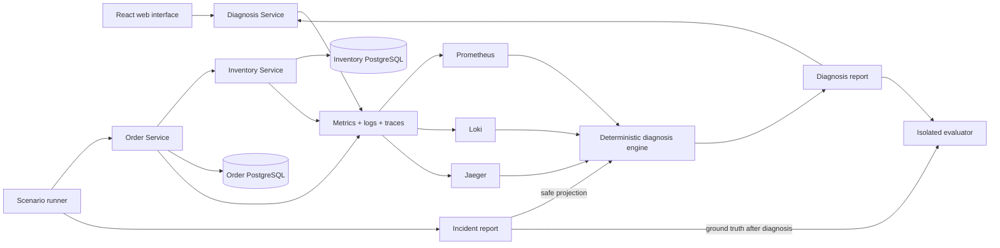

# RootLens

RootLens is a local-development observability and deterministic incident-
diagnosis project for a small distributed Order and Inventory application. It
turns correlated metrics, logs, and traces into evidence-backed root-cause
reports, while keeping scenario ground truth and optional LLM prose outside the
authoritative analysis boundary.

RootLens is an evaluation-oriented portfolio system, not a production incident
platform. It does not provide authentication, deployment, broad real-world
coverage, alerting, or automated remediation.

## Key capabilities

- Three independently testable Python 3.12 FastAPI services: Inventory, Order,
  and Diagnosis.
- Separate PostgreSQL databases owned by Inventory and Order.
- Request-ID and W3C trace propagation across Order, Inventory, and SQL calls.
- Prometheus metrics, Loki logs through Grafana Alloy, OTLP traces through the
  OpenTelemetry Collector to Jaeger, and provisioned Grafana dashboards.
- Three repeatable controlled scenarios with independent ground truth.
- A transparent deterministic engine with candidate scores, confidence,
  telemetry coverage, normalized evidence, warnings, and recommended checks.
- A safe Diagnosis API and responsive React/TypeScript investigation interface.
- Offline template explanations plus an explicitly enabled OpenAI prose option;
  neither can alter deterministic output.
- A repeatable benchmark with ground-truth isolation, per-scenario accuracy,
  confusion matrix, confidence/coverage aggregates, and atomic JSON/Markdown
  reports.
- Offline Python and frontend tests plus GitHub Actions validation for code,
  formatting, builds, Compose, dashboard JSON, tracked artifacts, and dependency
  consistency.

## Architecture



See [docs/ARCHITECTURE.md](docs/ARCHITECTURE.md) for component responsibilities,
data flow, observability, trust boundaries, and deterministic authority.

## Quick start

Use Python 3.12, Node.js 22, and Docker Compose. Create a private local
environment file from the example, start infrastructure, and install all local
Python packages:

```bash
cp .env.example .env
docker compose up -d
python3.12 -m pip install \
  -e 'tools/scenario_runner[dev]' \
  -e 'tools/diagnosis_engine[dev]' \
  -e 'tools/benchmark_runner[dev]' \
  -e 'services/inventory[dev]' \
  -e 'services/order[dev]' \
  -e 'services/diagnosis[dev]'
```

Load `.env`, apply the two existing migrations, then run each FastAPI service in
its own terminal:

```bash
set -a
source .env
set +a
alembic -c services/inventory/alembic.ini upgrade head
alembic -c services/order/alembic.ini upgrade head
uvicorn --app-dir services/inventory/src inventory_service.main:app \
  --reload --host 0.0.0.0 --port 8000 --env-file .env
```

```bash
uvicorn --app-dir services/order/src order_service.main:app \
  --reload --host 0.0.0.0 --port 8001 --env-file .env
```

```bash
uvicorn --app-dir services/diagnosis/src diagnosis_service.main:app \
  --reload --host 0.0.0.0 --port 8002 --env-file .env
```

Start the frontend:

```bash
cd apps/web
npm ci
npm run dev
```

Open <http://localhost:5173>. Follow [docs/DEMO.md](docs/DEMO.md) for a concise
inventory-unavailable walkthrough, evidence review, explanation validation,
Grafana/Jaeger inspection, benchmark, and safe shutdown.

## Supported incident catalog

| Scenario | Deterministic expected root cause |
| --- | --- |
| `baseline` | `none` |
| `inventory-latency` | `inventory_reservation_latency` |
| `inventory-unavailable` | `inventory_service_unavailable` |

No other scenario or incident rule is currently supported. `unknown` is the
safe fallback for missing, weak, or conflicting evidence.

## Evaluation

The live benchmark defaults to three repetitions of all supported scenarios,
10 requests per run, concurrency 5, a 1500 ms latency fault, and a 15-second
telemetry-settle interval:

```bash
rootlens-benchmark run
rootlens-benchmark summarize runtime/benchmarks/BENCHMARK_ID.json
```

A passing run requires at least one completed evaluation for every configured
scenario, valid evaluation for every completed diagnosis, usable telemetry, and
100% exact-match accuracy. This result measures only the small controlled
catalog and should not be generalized. See
[docs/EVALUATION.md](docs/EVALUATION.md) for methodology, isolation, confidence,
coverage, and limitations. Synthetic schema-preserving reports are in
[docs/examples](docs/examples/README.md).

## Screenshots

Screenshots are intentionally left as project-maintainer placeholders so no
private local data or credentials are committed.

- _Placeholder: system overview and recent incidents_
- _Placeholder: deterministic diagnosis with grouped evidence_
- _Placeholder: validated template explanation_
- _Placeholder: Grafana dashboard and Jaeger trace_

## Tests and CI

Install development dependencies as shown in Quick start. All normal tests use
fakes or in-process clients and require no Docker services, databases,
telemetry systems, developer runtime reports, or OpenAI access.

```bash
python3.12 -m pytest
python3.12 -m ruff check services tools test_support
python3.12 -m ruff format --check services tools test_support
```

```bash
cd apps/web
npm ci
npm run test:run
npm run lint
npm run format:check
npm run typecheck
npm run build
npm audit --json
```

Validate tracked configuration without starting the stack:

```bash
docker compose config --quiet
find observability/grafana/dashboards -name '*.json' -exec python3.12 -m json.tool {} \; >/dev/null
```

GitHub Actions runs separate Python 3.12, Node 22 frontend, and configuration
jobs on pull requests and pushes to `main`. CI forces template explanations,
removes the OpenAI key, and never runs the live benchmark.

## Documentation

- [Web interface](apps/web/README.md)
- [Architecture](docs/ARCHITECTURE.md)
- [Evaluation](docs/EVALUATION.md)
- [Recruiter/demo workflow](docs/DEMO.md)
- [Inventory Service](services/inventory/README.md)
- [Order Service](services/order/README.md)
- [Diagnosis Service](services/diagnosis/README.md)
- [Scenario runner](tools/scenario_runner/README.md)
- [Diagnosis engine](tools/diagnosis_engine/README.md)
- [Benchmark runner](tools/benchmark_runner/README.md)
- [Observability stack](observability/README.md)

## Technology stack

Python 3.12, FastAPI, Pydantic, SQLAlchemy, asyncpg, Alembic, HTTPX,
PostgreSQL 17, OpenTelemetry, Prometheus, Grafana, Loki, Alloy, Jaeger, React
18, TypeScript, Vite, Vitest, ESLint, Prettier, pytest, Ruff, Docker Compose,
and GitHub Actions.

## Current limitations

RootLens covers one local topology and three controlled cases. Fault injection
is development-only. Telemetry stores use local settings, Jaeger is not durable,
Loki and Grafana have no production security posture, and reports are local
files rather than a multi-user system. There is no authentication,
authorization, deployment, alerting, incident discovery, compensation,
reconciliation, autonomous action, or automated remediation. Optional OpenAI
use affects prose only and requires private explicit configuration.
