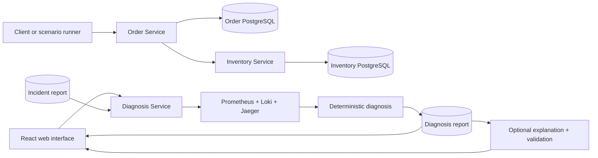
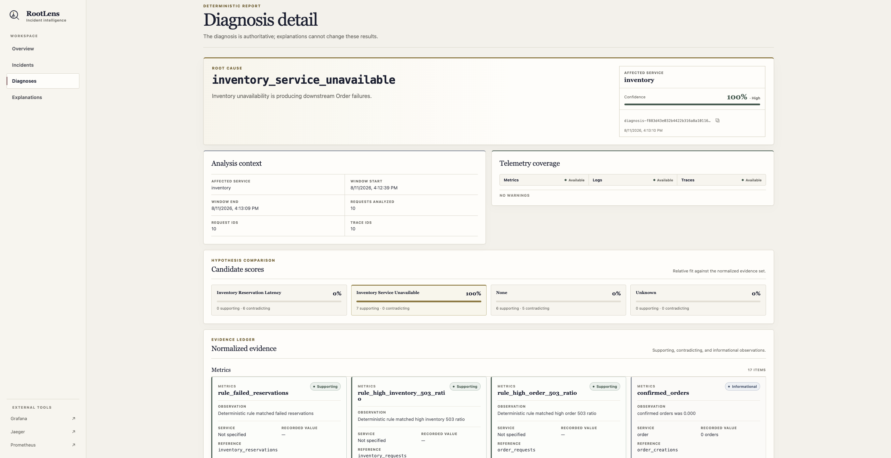
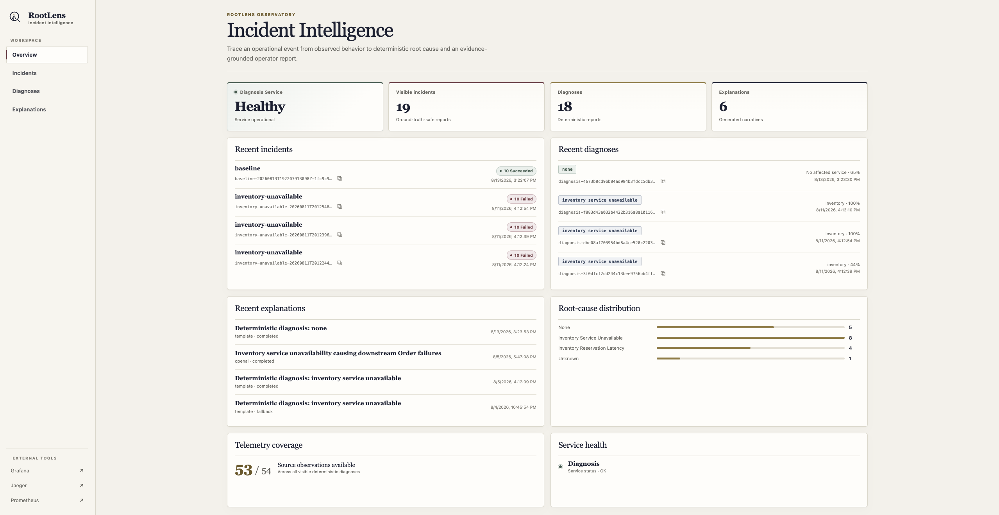
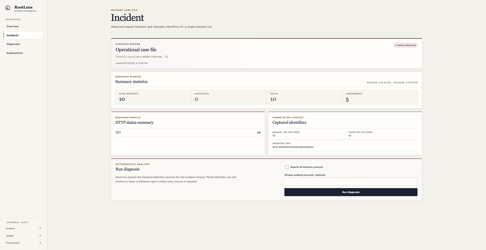
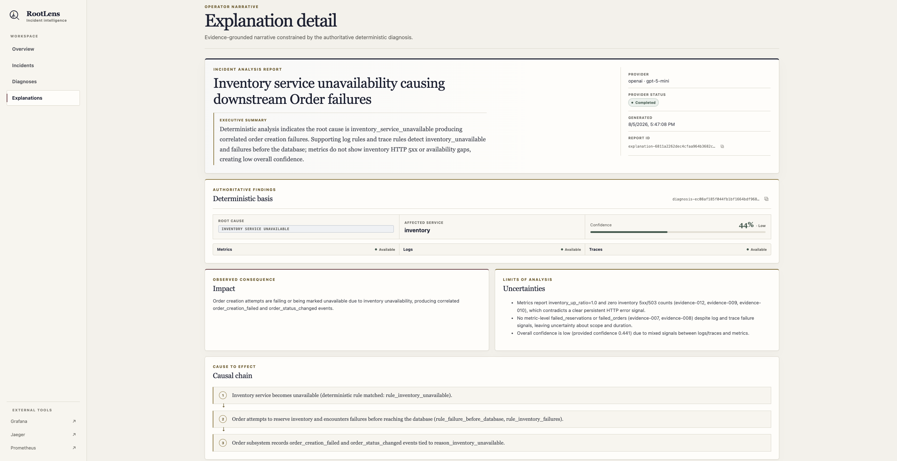
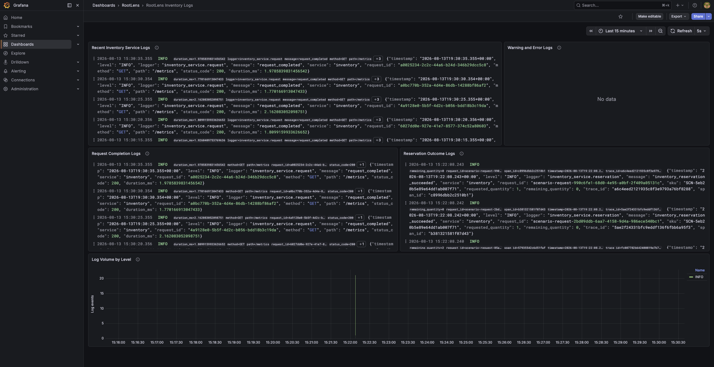
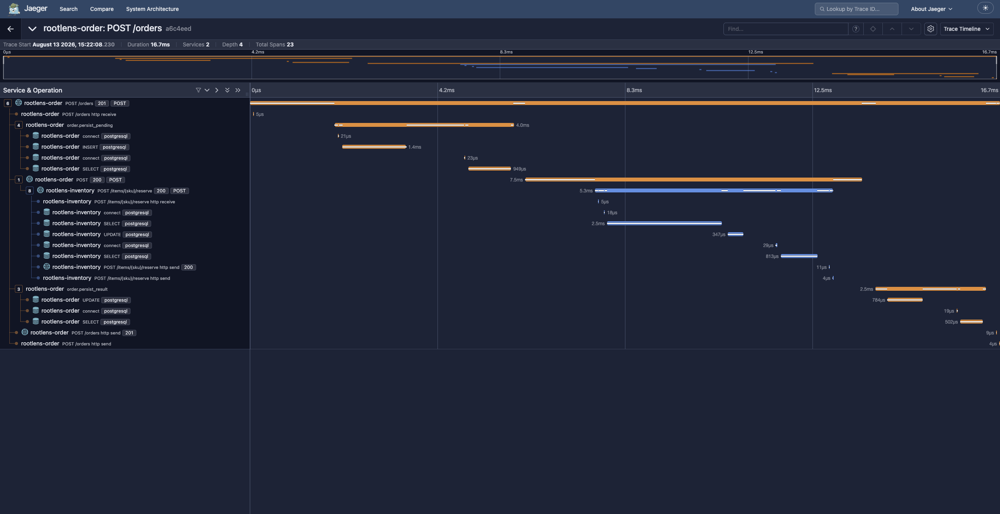
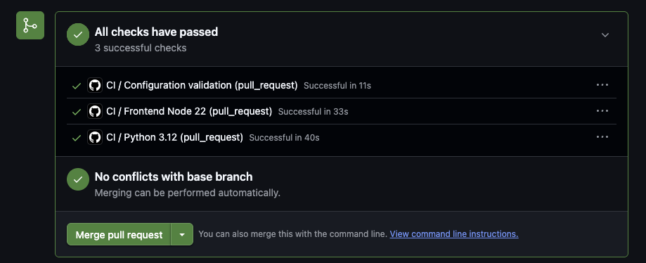

# RootLens

RootLens is a local observability and automated incident-diagnosis platform for a controlled distributed application.

RootLens correlates metrics, logs, and distributed traces to determine supported root causes, then optionally produces an evidence-grounded LLM explanation. It is an evaluation-oriented portfolio project: the supported incident catalog is deliberately small, the deterministic diagnosis is authoritative, and the LLM cannot choose or change the root cause.

## Capabilities

- Distributed Python 3.12 FastAPI Inventory and Order services with separate PostgreSQL databases.
- Request-ID propagation, W3C trace-context propagation, and retry-safe order creation with `Idempotency-Key`.
- Prometheus metrics, structured JSON logs centralized in Loki through Grafana Alloy, and OpenTelemetry traces routed through the Collector to Jaeger.
- Provisioned Grafana dashboards for service metrics, logs, and trace navigation.
- Controlled incident injection for repeatable baseline, Inventory latency, and Inventory unavailable scenarios.
- Deterministic telemetry normalization, correlation, candidate scoring, root-cause diagnosis, confidence, and coverage reporting.
- Optional template or OpenAI explanations constrained by the completed diagnosis, followed by deterministic validation.
- A FastAPI Diagnosis Service and responsive React/TypeScript web interface.
- Repeatable benchmark evaluation with exact-match accuracy, confidence and coverage aggregates, timing statistics, and a confusion matrix.
- GitHub Actions checks for Python, frontend, and tracked configuration quality.

## How it works

1. Generate or observe a supported incident.
2. Collect Prometheus metrics, Loki logs, and Jaeger traces.
3. Normalize and correlate the telemetry within one bounded incident window.
4. Deterministically select the supported root cause.
5. Optionally generate an LLM explanation constrained by that diagnosis.
6. Inspect the incident, diagnosis, evidence, and explanation in the RootLens web interface.
7. Validate the explanation deterministically against the authoritative diagnosis and evidence index.

### Deterministic diagnosis

This is the authoritative result. Explicit rules score normalized evidence and produce the root cause, affected service, confidence, telemetry coverage, candidate scores, warnings, and recommended checks. The same inputs produce the same decision.

### LLM explanation

This is optional operator-facing prose over an already completed diagnosis. The provider receives a safe typed projection, cannot query telemetry, and cannot select or modify the root cause. Application code preserves protected diagnosis fields, and offline validation rejects altered fields or unsupported evidence references. Template mode is the default and requires no network access.

## Supported root-cause catalog

| Root cause | Meaning |
| --- | --- |
| `none` | The controlled baseline is supported by healthy Order and Inventory telemetry. |
| `inventory_reservation_latency` | Inventory reservation work is the supported source of elevated latency. |
| `inventory_service_unavailable` | Inventory unavailability is supported by correlated failures and 503 outcomes. |
| `unknown` | Evidence is missing, weak, conflicting, or outside the supported catalog. |

Evaluation covers this controlled catalog through the `baseline`, `inventory-latency`, and `inventory-unavailable` scenarios. It does not measure arbitrary real-world incidents.

## Architecture



See [Architecture](docs/ARCHITECTURE.md) for service ownership, telemetry paths, correlation, safety boundaries, and evaluation isolation.

## Quick start

Prerequisites: Python 3.12, Node.js 22, and Docker Compose. From the repository root:

```bash
cp .env.example .env
```

Set `ROOTLENS_FAULT_INJECTION_ENABLED=true` only in the private local `.env` when running controlled scenarios. Then install the local Python packages and start infrastructure:

```bash
python3.12 -m pip install \
  -e 'tools/scenario_runner[dev]' \
  -e 'tools/diagnosis_engine[dev]' \
  -e 'tools/benchmark_runner[dev]' \
  -e 'services/inventory[dev]' \
  -e 'services/order[dev]' \
  -e 'services/diagnosis[dev]'
docker compose up -d
```

Load the environment and apply the existing service-owned migrations:

```bash
set -a
source .env
set +a
alembic -c services/inventory/alembic.ini upgrade head
alembic -c services/order/alembic.ini upgrade head
```

Run each backend command in a separate terminal:

```bash
uvicorn --app-dir services/inventory/src inventory_service.main:app \
  --reload --host 0.0.0.0 --port 8000 --env-file .env
```

```bash
uvicorn --app-dir services/order/src order_service.main:app \
  --reload --host 0.0.0.0 --port 8001 --env-file .env
```

```bash
uvicorn --app-dir services/diagnosis/src diagnosis_service.main:app \
  --reload --host 0.0.0.0 --port 8002 --env-file .env
```

Start the frontend:

```bash
cd apps/web
npm ci
npm run dev
```

Open <http://localhost:5173>. The [demo playbook](docs/DEMO.md) covers the complete 3–5 minute presentation and safe shutdown.

## Product screenshots

The diagnosis detail presents the deterministic root cause alongside confidence, telemetry coverage, candidate scores, and normalized supporting evidence.



The overview summarizes service health and recent incidents.



The incident detail brings the relevant request, service, and failure context together for investigation.



The explanation detail turns the diagnosis evidence into a concise, reviewable narrative.



### Observability

Grafana demonstrates structured centralized logs and observability dashboards.



Jaeger demonstrates the distributed Order → Inventory trace, including PostgreSQL spans.



### Continuous integration

Final pull-request checks cover Python 3.12, Frontend Node 22, and configuration validation.



## Evaluation

With the local application and telemetry stack running:

```bash
rootlens-benchmark run
rootlens-benchmark summarize runtime/benchmarks/BENCHMARK_ID.json
```

The benchmark diagnoses first and reads `expected_root_cause` afterward through a separate evaluator. LLM prose is never part of root-cause accuracy. Generated benchmark reports are ignored; tracked files in [docs/examples](docs/examples/README.md) are explicitly synthetic schema examples. See [Evaluation](docs/EVALUATION.md) for methodology and limitations.

## Quality checks

```bash
python -m pytest \
  services/inventory/tests \
  services/order/tests \
  services/diagnosis/tests \
  tools/scenario_runner/tests \
  tools/diagnosis_engine/tests \
  tools/benchmark_runner/tests \
  -v
python -m ruff check services tools test_support
python -m ruff format --check services tools test_support
```

```bash
cd apps/web
npm run test:run
npm run lint
npm run format:check
npm run typecheck
npm run build
cd ../..
docker compose config
```

GitHub Actions runs Python 3.12, Node 22 frontend, dependency, Docker Compose, dashboard JSON, and tracked-artifact checks. CI forces offline template explanations and does not run live benchmarks or make OpenAI requests.

## Technology stack

- **Backend:** Python 3.12, FastAPI, SQLAlchemy, PostgreSQL, Alembic, Pydantic, HTTPX.
- **Frontend:** React, TypeScript, Vite.
- **Observability:** Prometheus, Grafana, Loki, Alloy, OpenTelemetry, Jaeger.
- **Testing and quality:** pytest, Vitest, React Testing Library, Ruff, ESLint, Prettier, GitHub Actions.
- **AI:** optional OpenAI explanation provider; deterministic diagnosis remains authoritative.

## Documentation

- [Architecture](docs/ARCHITECTURE.md)
- [Evaluation](docs/EVALUATION.md)
- [Demo playbook](docs/DEMO.md)
- [Portfolio material](docs/PORTFOLIO.md)
- [Interview preparation](docs/INTERVIEW.md)
- [v1.0.0 release checklist](docs/RELEASE_CHECKLIST.md)
- [Screenshot guide](docs/screenshots/README.md)
- [Curated synthetic examples](docs/examples/README.md)
- [Web interface](apps/web/README.md)
- [Inventory Service](services/inventory/README.md)
- [Order Service](services/order/README.md)
- [Diagnosis Service](services/diagnosis/README.md)
- [Observability stack](observability/README.md)
- [Scenario runner](tools/scenario_runner/README.md)
- [Diagnosis engine](tools/diagnosis_engine/README.md)
- [Benchmark runner](tools/benchmark_runner/README.md)

## Scope and limitations

RootLens covers one local topology and a small synthetic incident catalog. Fault injection is development-only; telemetry stores use local settings; Jaeger is not durable; report artifacts are local files; and the project has no authentication, deployment, alerting, automated remediation, or claim of arbitrary production incident coverage. OpenAI remains optional and affects prose only.

Documentation is prepared for a manual `v1.0.0` release after the final pull request, checks, screenshots, and demo review are complete.
