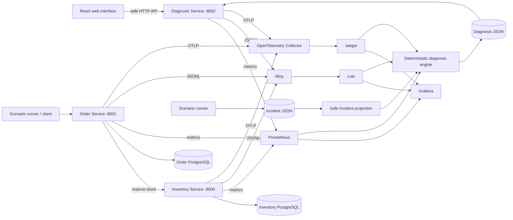
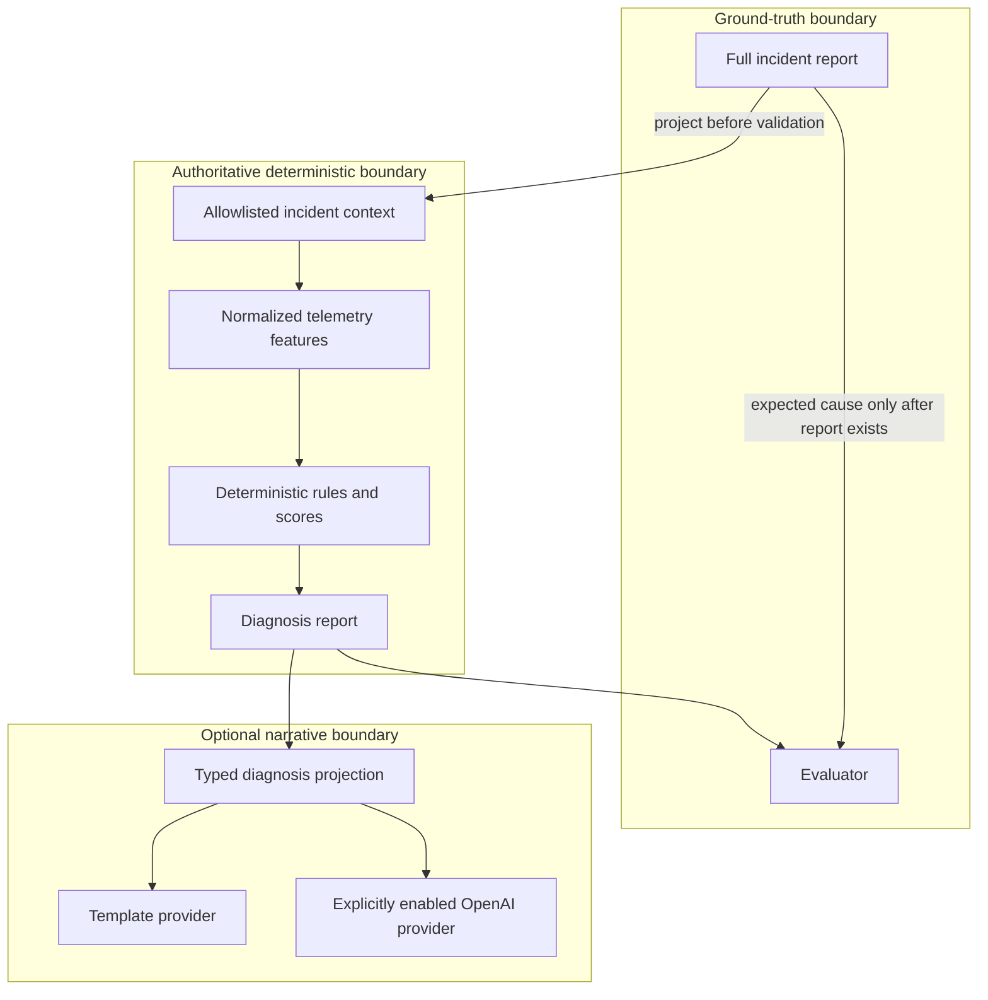

# RootLens architecture

RootLens is a local-development observability and deterministic incident-
diagnosis system built around a deliberately small distributed application. It
separates business data, telemetry, deterministic analysis, optional prose, and
evaluation ground truth so each boundary can be inspected and tested.

## Components

- **Inventory Service** is a Python 3.12 FastAPI service on port 8000. It owns
  inventory items and concurrency-safe reservations in Inventory PostgreSQL.
  Development-only, loopback-only fault controls can delay or reject reservation
  traffic when explicitly enabled.
- **Order Service** is a Python 3.12 FastAPI service on port 8001. It owns order
  lifecycle and idempotency data in Order PostgreSQL. It calls Inventory over
  HTTP while propagating request IDs and W3C trace context. It never writes the
  Inventory database and does not keep a database transaction open across the
  downstream request.
- **Diagnosis Service** is a Python 3.12 FastAPI service on port 8002. It exposes
  safe incident projections and persisted diagnosis/explanation artifacts by ID.
  It imports the deterministic engine directly and owns no database.
- **Scenario runner** creates one synthetic SKU, configures an allowed Inventory
  reservation fault, sends bounded Order traffic, validates the broad outcome,
  and writes an incident report with evaluation ground truth. It always attempts
  to clear the fault.
- **Diagnosis engine** projects a report onto an allowlist, queries a single
  normalized time window, extracts typed features, applies transparent scoring
  rules, and atomically writes a diagnosis. Supported root causes are `none`,
  `inventory_reservation_latency`, `inventory_service_unavailable`, and the
  insufficient-evidence fallback `unknown`.
- **Benchmark runner** repeats the supported scenarios, waits for telemetry,
  diagnoses each safe projection, persists it, then invokes the separate
  evaluator. It aggregates accuracy, confidence, coverage, timing, and a
  confusion matrix without invoking explanation providers.
- **React frontend** is a Vite/TypeScript investigation console on port 5173.
  It calls only the Diagnosis API through the local Vite proxy. It does not read
  report files or directly query databases or telemetry backends.

## Runtime topology

The two PostgreSQL instances are separate service-owned databases. Prometheus,
Grafana, Loki, Alloy, the OpenTelemetry Collector, and Jaeger run in Docker for
local development; the three FastAPI processes run on the host. Compose does
not run the business services or frontend.

## Request, trace, and report flow

1. The scenario runner sends `POST /orders` with a fresh request ID and
   idempotency key.
2. Order durably claims a pending order, calls Inventory, and propagates the
   request ID plus trace context. Inventory locks the item row for reservation.
3. Both services emit bounded metrics, structured JSON logs, and spans. Order
   records the final persisted status after the downstream call completes.
4. The scenario runner writes incident timestamps and correlation IDs alongside
   independent expected root cause. Incident files are outside the Alloy mount.
5. Diagnosis accepts only timestamps, request IDs, trace IDs, request count,
   SKU, and concurrency. It queries Prometheus, Loki, and Jaeger and writes an
   immutable diagnosis report.
6. Evaluation later loads that completed diagnosis and reads only
   `expected_root_cause` from the incident report.
7. The Diagnosis API and browser expose a separate safe incident projection;
   ordinary incident responses omit expected cause, expected symptoms, target
   service, and generation parameters.

## Telemetry responsibilities

- **Prometheus** scrapes `/metrics` on all three FastAPI services every five
  seconds and supplies bounded aggregate measurements to diagnosis.
- **Alloy** tails the three service JSONL files and sends them to **Loki**.
  Request-specific values remain JSON fields rather than high-cardinality labels.
- **OpenTelemetry Collector** receives OTLP from host services and forwards
  traces to **Jaeger**. Diagnosis queries exact trace IDs from the incident.
- **Grafana** provisions Prometheus, Loki, and Jaeger data sources and tracked
  dashboards. It is a human investigation surface, not an input to diagnosis.

## Trust boundaries

Private environment values, database credentials, full incident ground truth,
raw telemetry responses, and provider credentials are outside the browser and
generated benchmark reports. OpenAI use requires an explicit backend provider,
enable flag, and key. The template provider is the offline default. Provider
output is validated and cannot change protected diagnosis fields or cite unknown
evidence.

## Why deterministic diagnosis is authoritative

The supported catalog is intentionally encoded as visible rules with bounded
weights, decision thresholds, contradictions, source coverage, and evidence
references. The same normalized inputs therefore produce the same root cause.
Template and OpenAI providers receive only a completed diagnosis projection and
produce prose; application code copies every protected field into the final
explanation. Root-cause accuracy is evaluated on the deterministic field, never
on narrative quality. This keeps evaluation reproducible and prevents a fluent
explanation from overriding weak or missing telemetry.

RootLens is not production-ready. It has no authentication, deployment model,
alerting, automated remediation, durable Jaeger storage, or broad incident
catalog.
