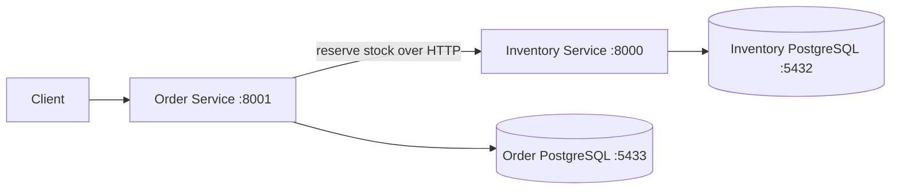
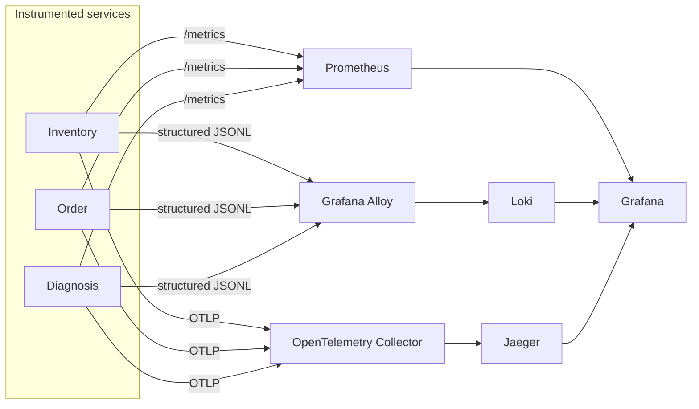
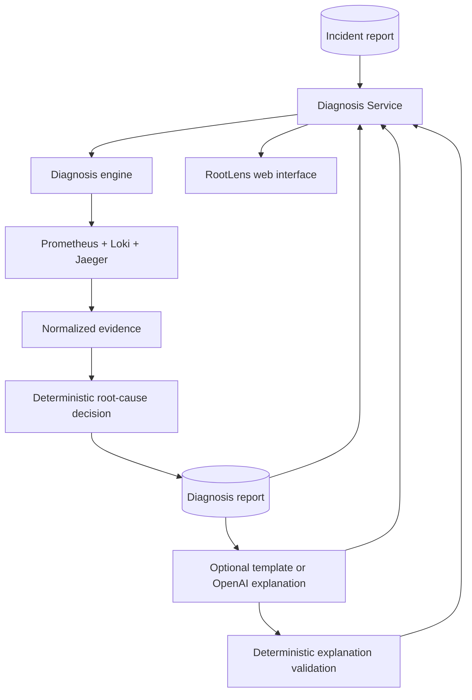
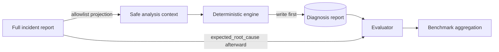

# RootLens architecture

RootLens is a local observability and deterministic incident-diagnosis system built around a deliberately small distributed application. Its boundaries keep business data, telemetry, ground truth, deterministic decisions, and optional prose independently inspectable.

## Service boundaries and business flow

- **Inventory Service** owns inventory items and concurrency-safe reservations in Inventory PostgreSQL. Development-only, loopback-only controls can delay or reject reservation traffic when explicitly enabled.
- **Order Service** owns pending, confirmed, rejected, and failed order records plus idempotency claims in Order PostgreSQL. It never reads or writes Inventory tables.
- **Diagnosis Service** owns the safe HTTP boundary for incident, diagnosis, and explanation report files. It imports the diagnosis engine directly and owns no database.
- **React frontend** calls only the Diagnosis Service through the Vite `/api` proxy. It does not access report paths, databases, telemetry APIs, or OpenAI directly.

Separate databases preserve service ownership and keep schema, transaction, and failure handling boundaries explicit. Order commits a pending record before calling Inventory and commits the terminal outcome afterward; it does not hold a database transaction open across the network call.

### Request identity, trace context, and idempotency

The inbound `X-Request-ID` is preserved when non-empty or generated when absent. Order forwards it to Inventory so structured logs can correlate one logical request across services. OpenTelemetry instrumentation separately propagates W3C `traceparent` context through the HTTPX call, creating a distributed trace across Order, Inventory, and instrumented SQL operations.

A request ID is an application correlation value that may be supplied by a client and can connect logs even when tracing is disabled. A trace ID is generated by the tracing system and identifies an entire span tree. They are related but not interchangeable.

`Idempotency-Key` makes an Order POST safe to retry. Order atomically claims a non-null key with a PostgreSQL partial unique index and stores a request fingerprint. A matching retry replays the stored terminal result, while payload mismatch or in-progress processing returns a safe conflict. Raw keys are never logged, traced, or used as telemetry labels.

## Observability flow

Prometheus scrapes each service every five seconds. Its labels are limited to bounded dimensions such as method, route template, status code, outcome, root cause, and provider status. Request IDs, trace IDs, SKUs, order IDs, and idempotency keys would create unbounded series and therefore are not Prometheus labels.

Alloy tails the three JSONL files and sends them to Loki. Loki indexes only `service`, `environment`, `level`, and `job`; request IDs and trace IDs remain parsed JSON fields. This retains query-time correlation without creating an ever-growing high-cardinality index.

The OpenTelemetry Collector receives OTLP from the host services and forwards traces to Jaeger. Grafana provisions Prometheus, Loki, and Jaeger data sources and tracked dashboards. Grafana is a human investigation surface, not a diagnosis input.

## Diagnosis and explanation flow

The scenario runner creates bounded controlled traffic, records timestamps and correlation IDs, and writes a full incident report. Diagnosis projects that report onto an allowlist before Pydantic validation, queries all three telemetry sources concurrently over one padded and capped UTC window, extracts typed features, and applies visible scoring rules. Missing sources fail independently and are represented in telemetry coverage rather than silently imputed.

Normalized evidence contains stable references, safe attributes, counts, durations, categories, severities, and selected trace identifiers. It excludes raw telemetry payloads, request bodies, SQL and parameters, credentials, idempotency keys, environment contents, and raw exceptions. Candidate scores expose supporting and contradicting evidence so the decision can be inspected.

The deterministic diagnosis is authoritative. The optional template or OpenAI provider receives only a typed projection of the completed diagnosis. Application code copies protected root cause, service, confidence, coverage, and evidence fields into the explanation report. The provider cannot query telemetry, use tools, or change the diagnosis. Offline validation checks protected fields, the complete evidence index, citation IDs, required narrative fields, provider status, ground-truth absence, and obvious credential material.

## Ground-truth isolation and evaluation

The analyzer receives only timestamps, request IDs, trace IDs, total request count, SKU, and concurrency. It never receives the scenario name or ID, expected root cause, expected symptoms, target service, incident filename, or path. The evaluator first loads an already-written diagnosis and only then reads `expected_root_cause`. Scenario labels may appear in final benchmark reporting after evaluation but cannot flow back into analysis.

The benchmark runner executes configured scenarios in order and runs each scenario's repetitions sequentially, waits for telemetry, writes the diagnosis, evaluates it, and aggregates exact-match accuracy, confidence, telemetry coverage, diagnosis duration, scenario duration, warnings, and a confusion matrix. It does not generate explanations or include prose quality in accuracy.

## Report filesystem safety and concurrency

Runtime reports are local JSON files under configured roots. The Diagnosis API accepts strict report IDs rather than caller-supplied paths: IDs are length-limited, decoded traversal is rejected, absolute paths, dots, and separators are rejected, and only direct non-hidden `.json` files whose embedded ID matches are read. Evaluation and validation suffixes are excluded from ordinary diagnosis and explanation collections.

Reports use unique IDs and atomic temporary-file replacement, so readers do not observe partially written JSON and concurrent requests do not share an output filename. Telemetry HTTP clients are application-scoped, while source queries within a diagnosis run execute concurrently. This is suitable for the trusted local workflow, not a multi-user persistence or job-processing design.

## Runtime topology and limitations

Docker Compose runs the two PostgreSQL databases, Prometheus, Grafana, Loki, Alloy, the OpenTelemetry Collector, and Jaeger. The three FastAPI services and Vite frontend run on the host. Generated incidents, diagnoses, explanations, validations, and benchmarks remain ignored local artifacts; only `.gitkeep` files and curated synthetic examples are tracked.

RootLens has no authentication, deployment model, alerting, automated remediation, durable Jaeger storage, distributed work queue, or broad diagnosis catalog. Fault injection and default credentials are local-development controls only.
